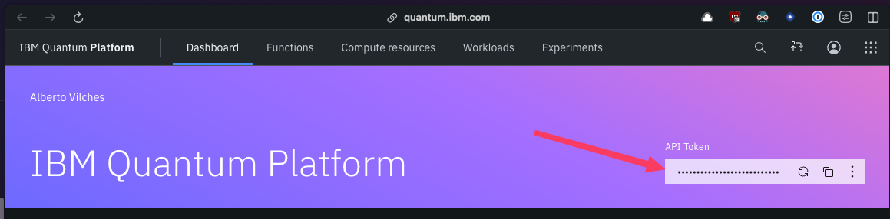

# Qiskit MCP

Quantum circuit integration using Model Context Protocol (MCP) endpoints.

## About

This project bridges quantum computing with large language models through a Model Context Protocol (MCP) interface. Built on Qiskit, it lets Claude and other MCP-compatible LLMs create and run quantum circuits based on natural language instructions.

Users can describe quantum operations in plain English, and the system handles the translation to OpenQASM code, executes it on IBM Quantum simulators or real hardware, and returns measurement results - all without writing a single line of Qiskit code.

Perfect for quantum exploration without the steep learning curve of quantum programming.

Check out the demo video below to see how it works
[](https://www.youtube.com/watch?v=xLTrt35LbS0)


## Key capabilities

- Bell state circuit generation (demo)
- OpenQASM 2.0 circuit creation
- Circuit execution on simulators or IBM Quantum hardware
- Backend discovery

## Prerequisites

- Python 3.10+
- Qiskit libraries
- FastMCP
- httpx

## Setup

1. Clone the repo:

```bash
git clone https://github.com/yourusername/mcp-qiskit.git
cd mcp-qiskit
```

2. Install [qiskit](https://docs.quantum.ibm.com/guides/install-qiskit) and the dependencies:

```bash
pip install -r requirements.txt
```

3. Configure your IBM Quantum account in https://quantum.ibm.com/ and get your API key.

 
4. Create a file `$HOME/.qiskit/config.json` like this with the api token: 
```json
{
  "ibm_token": "<put here your IBM Quantum API token>"
}
```

## Running

Launch the server with:

```bash
python main.py
```

## Claude Desktop integration

To use with Claude Desktop:

1. Add to your Claude config:

```json
{
  "mcp_servers": [
    {
      "name": "Qiskit",
      "path": "/path/to/mcp-qiskit/run_server.sh"
    }
  ]
}
```

2. Restart Claude Desktop

## MCP endpoints

The server provides these functions:

- `list_backends` - Shows available Qiskit backends
- `create_bell_circuit` - Creates a basic entanglement circuit
- `create_custom_circuit` - Builds a circuit from OpenQASM code
- `execute_circuit` - Runs circuits and returns measurement results

## Demo

<video src="https://github.com/avilches/mcp-qiskit/raw/refs/heads/main/resources/demo-1.mp4"></video>
[demo-1.mp4](resources/demo-1.mp4)

<video src="https://github.com/avilches/mcp-qiskit/raw/refs/heads/main/resources/demo-2.mp4"></video>
[demo-2.mp4](resources/demo-2.mp4)

## License

CC0 (Creative Commons Zero)